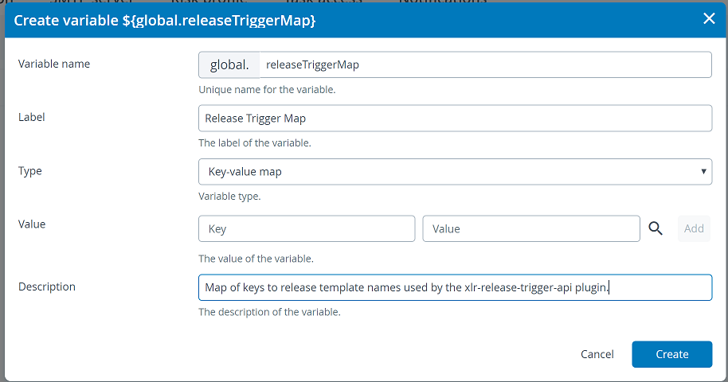

# XL Release Trigger API

[![Build Status][xlr-release-trigger-api-travis-image]][xlr-release-trigger-api-travis-url]
[![Codacy Badge][xlr-release-trigger-api-codacy-image] ][xlr-release-trigger-api-codacy-url]
[![Code Climate][xlr-release-trigger-api-code-climate-image] ][xlr-release-trigger-api-code-climate-url]
[![License: MIT][xlr-release-trigger-api-license-image]][xlr-release-trigger-api-license-url]
[![Github All Releases][xlr-release-trigger-api-downloads-image]]()

## Preface

This document describes the functionality provided by the XL Release xlr-release-trigger-api.

See the [XL Release reference manual](https://docs.xebialabs.com/xl-release) for background information on XL Release and release automation concepts.  

## Overview

This plugin implements a custom REST API that will start a release and populate release variables with POST parameters.  The API will accept a template name as a POST parameter or a key that maps to a template name.

## Requirements
*  **XL Release**   9.0.0+

## Installation

* Copy the latest JAR file from the [releases page](https://github.com/xebialabs-community/xlr-release-trigger-api/releases) into the `XL_RELEASE_SERVER/plugins/__local__` directory.
* Restart the XL Release server.

## Usage

To create a release, make an HTTP POST request to...

```bash
http://<your xl release>/api/extension/release-trigger
```

| Http Headers |    |
| ------------ | -- |
| encoding | UTF-8 |
| content-type | application/json |

The POST body will be a JSON object structured like this...

```bash
{
	"template_name|template_key": "tempate_name_or_key",
	"title": "release title",
	"description": "description for release (optional)",
	"folder_path":"folder path for release (optional)",
	"scheduledStartDate":"mm/dd/yyyy (optional)",
	"dueDate":"mm/dd/yyyy (optional)",
	"owner":"release owner (optional)",
	"tags":["tag1", "tag2"] (optional),
	"autoStart":true|false (optional),
	"<release_variable_name_1>" : "release_variable_value",
	...
}
```

### Parameters

| Parameter Name | Description | Required? |
| ----------- | ----------- | ----------- |
| template_name | The name of the template used to create the release. | Either this or 'key' is required. |
| template_key  | The key name used to look up the template name.  See below. | Either this or 'template_name' is required. |
| title         | Title for the release | Required |
| description   | Description for the release | Optional |
| folder_path   | Full path to folder for release | Optional |
| scheduledStartDate | Scheduled date for the release as mm/dd/yyyy | Optional |
| dueDate            | Anticipated due date for the release as mm/dd/yyyy | Optional | owner              | Owner of the release | Optional |
| tags               | List of tags for the release | Optional |
| autoStart          | 'true' if you want the release started immediately.  Note the start date becomes today in this case regardless of the scheduledStartDate. | Optional |
| release variables | Any number of release variable names and values.  See below. | Optional |

### Using 'template_name' parameter

The 'template_name' parameter value is the name of the template to use for the release.  The template name value is case sensitive and must match the template name in XL Release exactly.  You may use this to specify the template or use the following 'key' value to look up the template.  Only one of the two parameters is required.

### Using 'key' parameter

If you don't want to maintain template names in your system making the REST call, you can pass a 'key' instead.  This key is used for a dictionary lookup that will map to a template name.  This key -> template map is maintained in XL Release as a global variable as shown below...



Note the global variable 'name' is 'releaseTriggerMap'.  The 'type' is 'key-value map'.  These are required.

The 'key' part of the map can be any text string.  It may, for example, represent a project id or team name.  The 'value' part is the template name and must match the name of an existing template.  If you don't use the 'key' parameter then you don't need to create this global variable.

### Using 'release variables' parameters

You may optionally pass any number of release variable names and values.  The release variable name used in the JSON body must match an existing release variable name in the template.  The variable JSON type must match the variable type in XL Release.  Any release variable you specify in the JSON body that is not found in the XL Release template is simply ignored.

### Response

The response object is...

```json
{
	"entity":
		{
			"release_id":"Applications/Released7ec97f397284d738506c9d41a1f2c64",
			"template_id":"Applications/Release3dfc29e6838f438984be0dd69cd2fab4"
		},
	"stdout":"",
	"stderr":"",
	"exception":null
}
```

The 'template_id' is the XL Release ID for the selected template.  The 'release_id' is the XL Release ID for the generated release.  If an exception was generated as a result of the call, the 'exception' property will have its description.

## Developers

### Prerequisites

1. You will need to have Docker and Docker Compose installed.
2. The XL-Release docker container expects to find a valid XL-Release license on your machine, at this location: ~/xl-licenses/xl-release-license.lic.

### Build and package the plugin

Execute the following from the project root directory:

```bash
./gradlew clean assemble
```

Output will be placed in ./build/libs folder.

### To run integration tests

Execute the following from the project root directory:

```bash
./gradlew clean itest
```

The itest will set up a containerized xlr/\<???\> testbed using Docker Compose.

### To run demo or dev version

```bash
cd ./src/test/resources
docker-compose -f docker/docker-compose.yml up
```

NOTE:

1. XL Release will run on the [localhost port 15516](http://localhost:15516/).
2. The XL Release username / password is admin / admin.

[xlr-release-trigger-api-travis-image]: https://travis-ci.org/xebialabs-community/xlr-release-trigger-api.svg?branch=master
[xlr-release-trigger-api-travis-url]: https://travis-ci.org/xebialabs-community/xlr-release-trigger-api

[xlr-release-trigger-api-codacy-image]: https://api.codacy.com/project/badge/Grade/88dec34743b84dac8f9aaaa665a99207
[xlr-release-trigger-api-codacy-url]: https://www.codacy.com/app/ladamato/xlr-release-trigger-api

[xlr-release-trigger-api-code-climate-image]: https://codeclimate.com/github/xebialabs-community/xlr-release-trigger-api/badges/gpa.svg
[xlr-release-trigger-api-code-climate-url]: https://codeclimate.com/github/xebialabs-community/xlr-release-trigger-api

[xlr-release-trigger-api-license-image]: https://img.shields.io/badge/License-MIT-yellow.svg
[xlr-release-trigger-api-license-url]: https://opensource.org/licenses/MIT
[xlr-release-trigger-api-downloads-image]: https://img.shields.io/github/downloads/xebialabs-community/xlr-release-trigger-api/total.svg
